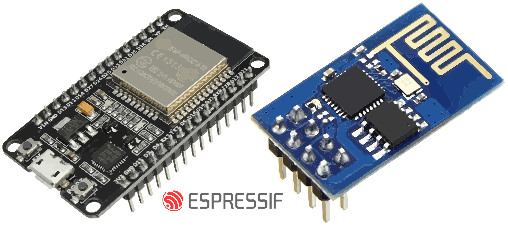
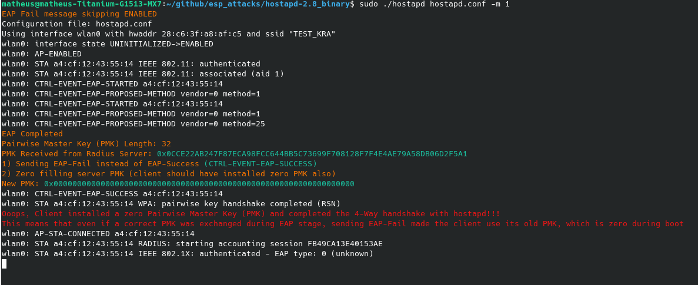
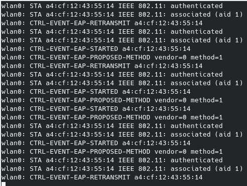

## ESP32/ESP8266 Wi-Fi Attacks
**This repository is part of a research outcome from the [ASSET Research Group](https://asset-group.github.io/).
This research was partially supported by [Keysight Technologies](https://www.keysight.com/sg/en/home.html).**


This repository demonstrates 3 Wi-Fi attacks against the popular ESP32/8266 IoT devices:

* **[Zero PMK Installation (CVE-2019-12587)](https://matheus-garbelini.github.io/home/post/zero-pmk-installation/)** - Hijacking ESP32/ESP8266 clients connected to enterprise networks;
* **[ESP32/ESP8266 EAP client crash (CVE-2019-12586)](https://matheus-garbelini.github.io/home/post/esp32-esp8266-eap-crash/)** - Crashing ESP devices connected to enterprise networks;
* **[ESP8266 Beacon Frame Crash (CVE-2019-12588)](https://matheus-garbelini.github.io/home/post/esp8266-beacon-frame-crash/)** - Crashing ESP8266 Wi-Fi devices.

**Follow the links on each vulnerability for more details and Espressif's patches.**

This vulnerabilities were found in SDKs of ESP32 and ESP8266. Their version were ESP-IDF v4.0-dev-459-gba1ff1692 and NONOS-SDK v3.0-103-g7a31cb7 respectivelly at the time of the discovery.

While a custom version of hostapd is provided to test the first 2 vulnerabilities, for the last one, an ESP8266 is used to inject fake 802.11 beacon frames in order to crash others of its own (no pun intended!).

### PoC Building and running instructions

##### Running pre compiled binary

​	If you are running debian or ubuntu you can execute the already compiled hostapd in the folder `hostapd-2.8_binary`. Just run `hostapd-2.8_binary/run_hostapd_exploit.sh` to start the access point to test the vulnerability or `hostapd-2.8_binary/run_zero_pmk_EAP.sh` to start without this test. Be advised that you need to stop network services with `service network-manager stop` for your Wi-Fi interface to be free.

###### TLDR:

```shell
service network-manager stop
./run_zero_pmk_EAP.sh # to test against CVE-2019-12587 (remember to restart ESP first)
./run_crash_esp_EAP.sh # to test against CVE-2019-12586
```

##### Running from source

​	If for some reason the binary doesn't work with your system, you can compile the project `hostapd-2.8_source` by running the script `./buid.sh`. The script installs the following dependencies before running the tool: `build-essential pkg-config git libnl-genl-3-dev libssl-dev libnl-route-3-dev`.

​	After the build is successful, you can run the script `./run_zero_pmk_EAP.sh` to start the access point to test the vulnerability or `./run_hostapd_normal.sh` to start without the test.

###### TLDR:

```shell
./build
./run_zero_pmk_EAP.sh # to test against CVE-2019-12587 (remember to restart ESP first)
./run_crash_esp_EAP.sh # to test against CVE-2019-12586
```

##### Testing beacon frame crash (CVE-2019-12588)

In order to compile the code for esp8266 in folder **beacon_frame_crasher** , it's necessary to follow the steps in [ESP8266 Deauther](https://github.com/spacehuhn/esp8266_deauther/wiki/Installation#compiling-using-arduino-ide). This is a modified version of the board support package for ESP8266 that allows the injection of raw 802.11 frames. A binary is also provided for a quick test in `beacon_frame_crasher/ESP8266Crasher.ino.d1_mini.bin` in case you have a spare wemos d1 mini board. Note that this code is hardcoded to crash an ESP8266 configured for an access point with a ssid=TEST_KRA. As soon as the "beacon frame crasher" device starts, the other ESP8266 devices connected to the access point should restart intermittently.

Alternatively, if your Wi-Fi hardware supports monitoring and injection, you can run the python script:

```shell
sudo apt-get install -y aircrack-ng
sudo airmon-ng check kill
sudo airmon-ng wlan0 start # wlan0 is your wifi interface name
pip install scapy
python beacon_frame_crasher/ESP8266Crasher.py
```

### PoC Output

If your ESP device SDK is vulnerable to **CVE-2019-12587**, you should receive an output like this from hostapd:



If your ESP device SDK is vulnerable to **CVE-2019-12586**, you should receive an output like this from hostapd:



In this case, as the device is restarting every time it attempts a connection with hostapd, you should receive a lot of logs indicating re-connection. If you're monitoring the device serial port, you can also receive trace logs.

### Configuring

By default the PoC access point has the following default configuration:

* ssid=TEST_KRA
* channel=9
* bssid=28:c6:3f:a8:af:c5
* interface=wlan0
* server_cert=wpa2_server.pem
* private_key=wpa2_server.key
* user=matheus_garbelini
* user_password=testtest
* EAP method=PEAP

To change this options, change the file `hostapd.conf` in the root folder of hostapd (`hostapd-2.8_binary/hostapd.conf` or  `hostapd-2.8_source/hostapd/hostapd.conf`). **Please change the interface  parameter to match your Wi-Fi NIC, it's advised to leave other parameters as the default if you wish to test the ESP32/8266 client test codes. Correct certificates are also included (same from ESP-IDF repository), so no need to change them in hostapd folder.**

If you wish to change EAP methods or username credentials, just change `hostapd.eap_user`

##### Attention

Check if you your openssl library allows to use TLS version of 1.0. You can change this configuration normally in `/etc/ssl/openssl.cnf`,  Changing the last lines to:

```shell
[system_default_sect]
MinProtocol = TLSv1.0
CipherString = DEFAULT@SECLEVEL=1
```

### Test client codes (optional)

The codes used for testing the vulnerable devices is in folder `esp_client_test_codes`. 

`ESP32_Arduino_EAP_Client` and `ESP8266_Arduino_EAP_Client` can be compiled by using their respective Arduino board support packages ([arduino-esp32](https://github.com/espressif/arduino-esp32) and [arduino-esp8266](https://github.com/esp8266/Arduino)). As for non-arduino codes, ESP-IDF and ESP8266_NONOS_SDK are required to compile `ESP8266_EAP_Client` and `ESP32_EAP_Client`. Note that you need to use the same or earlier SDKs as mentioned here to trigger all the described vulnerabilities. 
